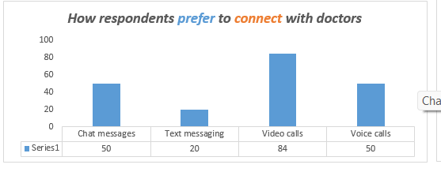
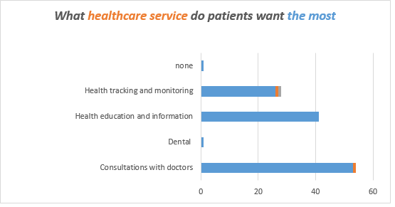

# Medvive Healthcare Telemedicine Survey Analysis and Insights 

### Project Overview
As the data analyst for Medvive Healthcare Technology Limited, I conducted a comprehensive analysis of a survey aimed at understanding user preferences, challenges, and sentiments toward telemedicine services in Nigeria. This report details the data collection, cleaning, analysis, and key findings that informed actionable recommendations for enhancing Medvive's telehealth platform.

### Problem Statement
Medvive Healthcare Technology Limited, a Nigerian telemedicine startup, is focused on creating accessible telehealth solutions for Nigerians. To tailor their services to user needs, a survey was conducted to gauge public opinion on various aspects of telemedicine, including the preferred consultation methods, perceived challenges, and overall attitudes towards telemedicine.

### Data Collection
Data was collected via Google Forms, where respondents answered a series of pre-defined questions. The responses were then exported to Google Sheets for analysis.

### Data Cleaning and Preparation
As part of the data cleaning process, I undertook the following steps:
- **Removed incomplete entries** to ensure the dataset was robust and reliable for analysis.
- **Renamed columns** to enhance clarity and make the dataset more intuitive.
- **Standardized and transformed user inputs**, especially regarding perceptions of telemedicine apps, to ensure consistency across responses.
- **Split and aggregated data** where necessary, ensuring it was formatted correctly for further analysis and visualization.

### Data Analysis & Visualization
The survey gathered 125 responses, comprising 97 females and 28 males, with the majority of respondents aged between 21 and 30 years. I conducted a detailed analysis, focusing on key insights that could guide the development and improvement of Medvive's telemedicine services.

Key Findings:
- **Challenges with Physical Appointments**: 55% of respondents reported difficulties in scheduling physical appointments. Despite these challenges, 49% still expressed a preference for physical consultations over online options.
- **Health-Seeking Behavior**: The analysis revealed that a significant majority of respondents (80%) rarely or occasionally sought medical advice, with only 20% doing so regularly (5 or more times a year). This reflects the generally low health-seeking behavior typical among Nigerians.   
     
      
  
- **Preferred Consultation Medium**: Video calls emerged as the most favored consultation medium, with 67% of respondents preferring this method. Voice calls and chat messages were also popular, with 40% of respondents comfortable using these mediums. However, only 16% considered traditional text messaging as a viable option.
     
      
  
- **Most Favored Healthcare Services**: Consultations were the top service preferred by respondents, followed closely by health information and education, which were prioritized even above health tracking services.   
     
      
  

### Recommendations
Based on the analysis, I proposed the following recommendations:
1. **Enhance Video Call Capabilities**: Given that video calls are the preferred consultation method, Medvive should prioritize the development and optimization of video call features in their telemedicine app.
2. **Focus on Health Education**: Increasing efforts in health education and information dissemination could positively impact the health-seeking behavior of the target market.
3. **Promote the Benefits of Telemedicine**: To improve user adoption and sentiment, more comprehensive information should be provided about the benefits of telehealth and telemedicine.

### Reflection and Future Improvements
Looking back on the project, I identified several areas for improvement:
- **Expand Data Collection**: Collecting more detailed socioeconomic and demographic data would enable a deeper understanding of the factors influencing telemedicine preferences in Nigeria.
- **Simplify Survey Options**: Ensuring that survey options are clear and straightforward is crucial for obtaining high-quality data.
- **Increase Sample Size**: A larger dataset would provide more robust insights and improve the reliability of the analysis.

This project provided valuable insights that can guide Medvive Healthcare in optimizing their telemedicine platform, and it demonstrated the importance of thorough data analysis in driving informed decision-making.
